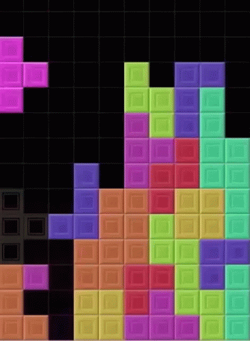
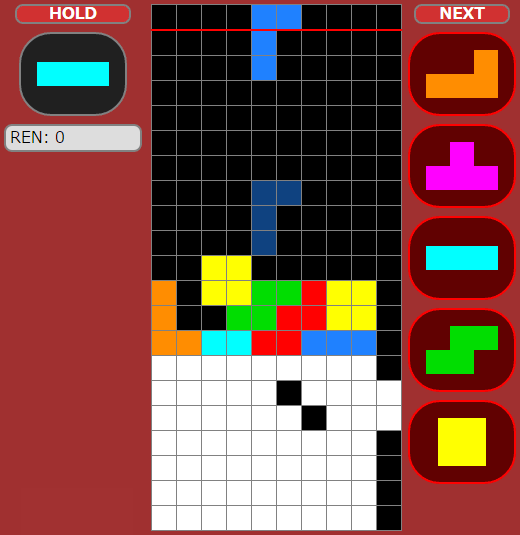

## spin 구현 완료
  
구글링을 시도하지 않았던 것은 아닌데,  
대전 테트리스는 소스 코드가 풀린 것을 쉽게 찾지 못했다.  
  
하지만 가장 이상적으로 원하던 스핀 로직을 결국 테트리스 위키에서 찾았다!  
<https://tetris.fandom.com/wiki/SRS>  
  
정확히 말하면 근본적인 스핀 원리..인지는 모르겠고  
억지로 스핀을 온전하게 구현할 수는 있게 되었다.  
  
## spin 구현 로직

구현 로직은 무식하고 간단하다.  

1. 회전시켜본다.
2. 실패하면 test1에 해당하는 칸으로 이동하여 회전시켜본다.  
3. 실패하면 test2..  
4. test3..
5. test4..
  
친절하게 각 테트로미노마다 test1~4에 해당하는 좌표도 적어놓아 참고하였다.  
근본적인 원리가 아니라면 관찰해가며 정리한 분에게 매우 감사하다.  

이 진리를 알기 전에는 테트리스 위키마다 테트로미노의 중심이 되는 칸을 표시해놓은 것을 보고 이 중심이 되는 칸을 기준으로 어떻게 스핀을 할지 매우 고민했었다.  
아래의 몇 가지 스핀을 함께 보며 감탄을 해보자.  

## spin 예시

  
  
  
  
  
  
  
테트리스를 해서 대부분은 익숙해졌지만, 스핀 몇 가지는 아직도 어이가 없게 느껴진다.  
막막했으나 해결했다면 ok  

## 엄

개강 전까지 유의미한 결과를 내보려고 했지만 속도를 좀 붙여야 할 것 같다.  
당장 앞으로 해야될 것은  

1. pygame 구현  
2. 로직 디버깅  
3. DAS, 땅에 굳기 구현
4. 이미지, 이펙트, 소리 등은 시간 되면;  
  
주말 지나고 나서 오픽 안하는 시간에 할 예정  
끗
