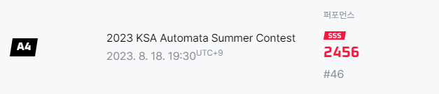

## 롤 신규모드인가요

아뇨 그거 아니고 제한시간 주고 PS 문제 푸는 대회입니다  
대충 K-코드포스라고 하네요.  
  
## 왜 나가셨나요

이런거 좋아하는데 마침 시간이 되길래 나갔읍니다  
최근에 클래스5 밀고 있는데 내가 잘 밀었나 확인도 할 겸  
잘 나간듯하네요  
  
## 어떠셨나요

크게 느낀 점을 정리하자면  

1. 재밌다  
   n시간 안에 집중해서 고민하고 푸니까 재밌어요 (하도 안 풀렸으면 재미없었을 듯)
   특히 D E 감도 안 잡히다 푼 게 제일 재밌었음
   거기다 배경지식 요하는 거 많고 그러지 않아서 굿  
2. 문제가 깔끔하다  
    귀찮게 세세한 조건들 생각해봐야 하거나 치명적인 테케로 낚는? 문제가 많이 없어서 좋았습니다
3. 마렵다  
    poscat에서 코드포스나 plus에서 CTF 좀 공부하고 해봐야겠다는 생각이 잔뜩 들었습니다  
    푼 문제 글 쓸지는 잘 모르겠.. "나중에"  

## 뽕맛

  

골딱이 중 최고의 플레이  
(전에 쉬운거 2개만 풀어도 A+인거 보면 잘 주나봄 그냥)  
  
D, E는 여기다 이어서 혹은 다른 글에다 풀이 써보겠읍니다  
  
## 테트리스 개발은 접으셨나요?

아  
  
근데 오픽하고 백준 깔짝거리면 시간이 가버려서 ㅋㅋ  
백준 class5(에센셜 말고 기본)이 2문제 남긴 했는데  
이거 끝나면 dreamhack을 할 듯 합니다  
  
지금:            오픽 + 백준(2문제만 더)  
class5 밀고:     오픽 + 드림핵  
오픽 보고(개강):  드림핵 + 테트리스 (+ 백준?)  
  
그래그래 열심히 하자
